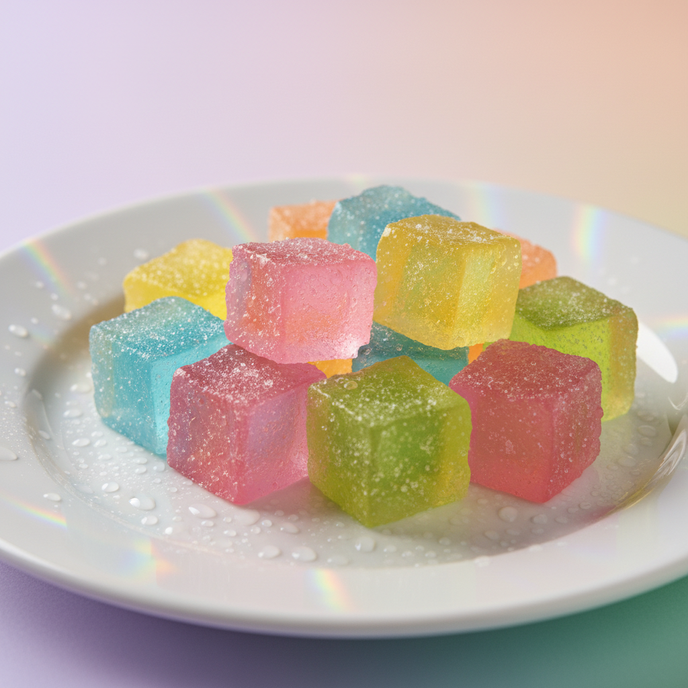
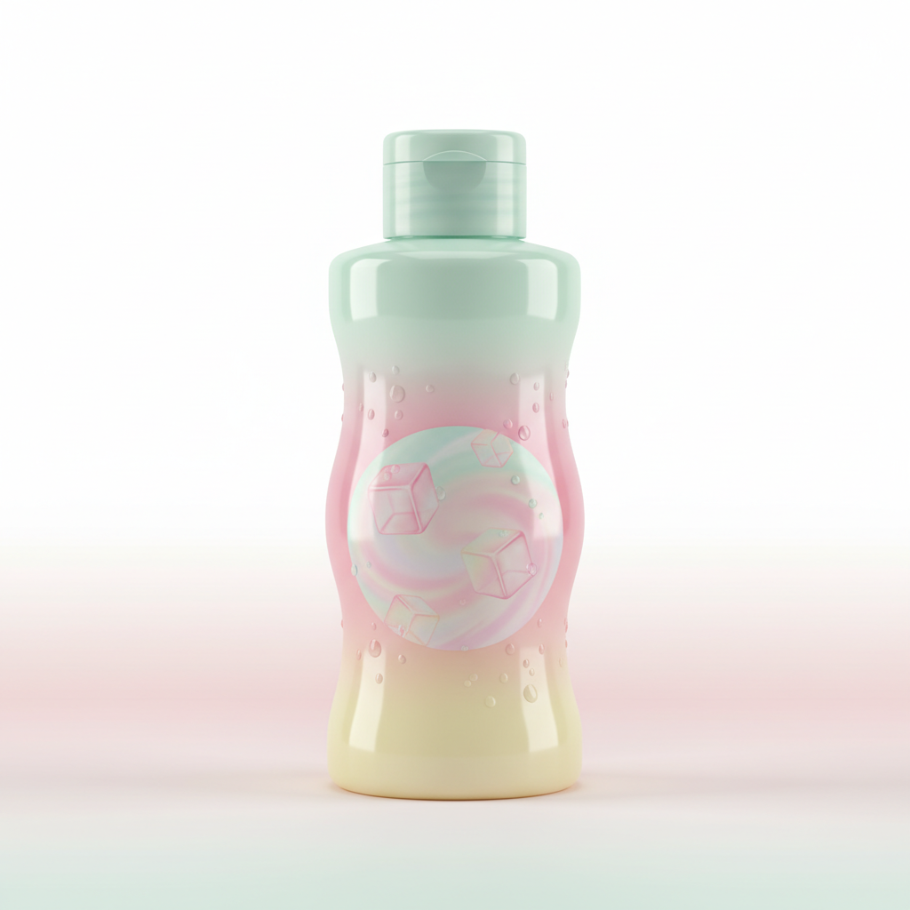
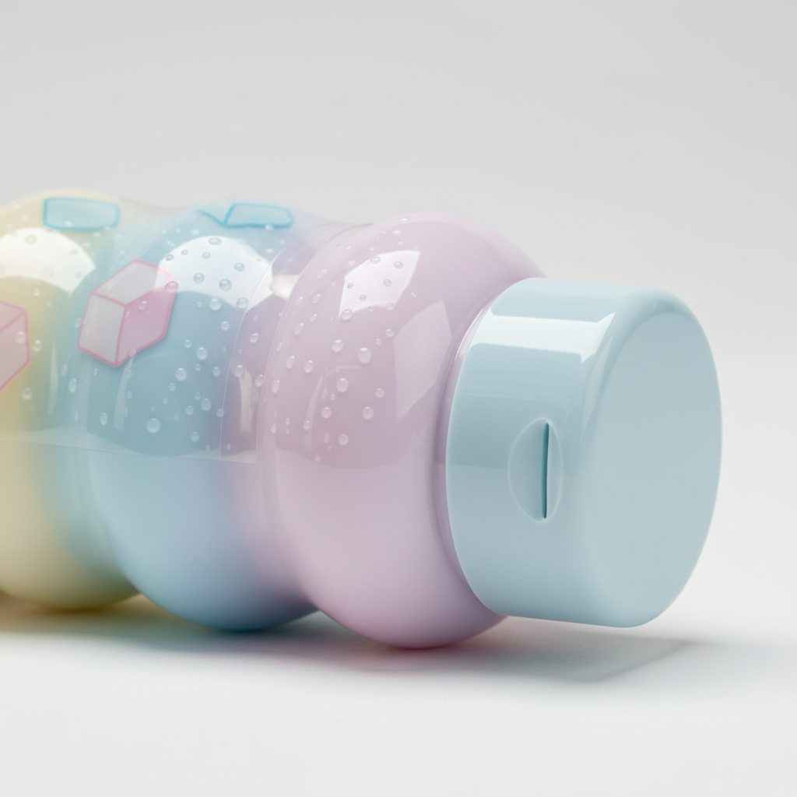
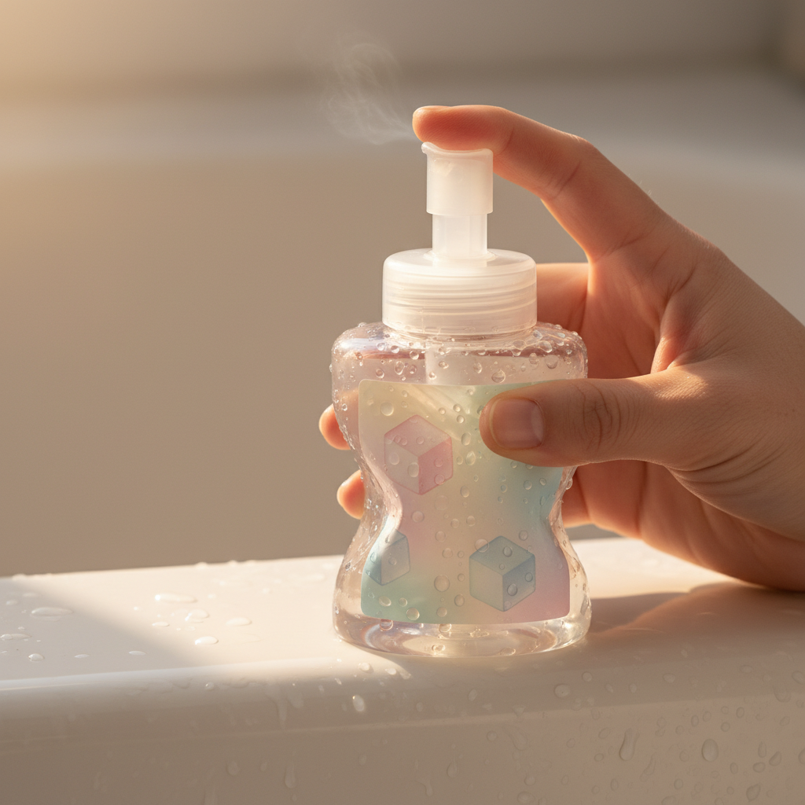

# AI Assisted Design Workflow and Prompt Guide

This guide outlines the multi-stage process for using AI to move from a high-level design goal to a fully realized product concept. Each stage uses specific prompts to refine the design direction.

## 1. Conceptualize

**Purpose:** Expand a high-level design goal (the "Parti") into a set of related conceptual keywords that provide depth and nuance to the initial idea.

**Data Input:**

- **Parti:** A high-level goal or theme (e.g., "Playfulness").

**Prompt:**

| Model     | Parameters        |
| :-------- | :---------------- |
| `gpt-5.2` | `reasoning: null` |

```txt
Generate conceptual keywords that best represent this Parti:

[Parti Text]

Generate up to 5 new concepts (one word, or compound word) with short descriptions that capture some essence of the Parti. Each concept should be unique and meaningful.
```

**Output Examples:**

```txt
- Whimsy: Lighthearted spontaneity that invites delight and surprise.
- Frolic: Playful, carefree activity marked by energetic joy and a sense of freedom.
- Gamefulness: A playful mindset that treats tasks and interactions like games—full of curiosity, challenge, and fun.
- Multi-sensory: Engaging multiple senses at once to create a richer, more immersive experience.
- Improvisation: Creating and responding in the moment without a fixed plan, guided by intuition and adaptability.
```

## 2. Embody (Moodboard)

**Purpose:** Translate abstract concepts into tangible visual artifacts and detailed descriptions suitable for image generation.

**Data Input:**

- **Parti:** The original design goal.
- **Concepts:** The list of keywords generated in the previous step.

**Prompt:**

| Model     | Parameters        |
| :-------- | :---------------- |
| `gpt-5.2` | `reasoning: null` |

```txt
Generate moodboard artifacts based on this Parti and concepts:

Parti: [Parti Text]
Concepts: [List of Concepts]

Generate 5 diverse artifacts that would be commonly seen in a moodboard. Each artifact should represent or evoke the Parti and be suitable for image generation.
An artifact should be grounded in the real world (object, material, texture, color, etc.).

Artifact name should be very short.
Artifact description should be one detailed sentence including subject, scene, and style for AI image generation.
```

**Image Generation:**

| Model                    | Parameters                                 |
| :----------------------- | :----------------------------------------- |
| `gemini-2.5-flash-image` | `responseModalities: ["IMAGE"]`            |
| `FLUX.1-schnell-free`    | `steps: 4`, `disable_safety_checker: true` |

**Output Examples:**

```txt
- Confetti burst: A candid street-level photo of a hand popping a biodegradable confetti cannon on a sunny sidewalk, with colorful paper pieces mid-air, surprised laughing faces in soft focus, and a bright high-saturation editorial style with crisp freeze-frame motion.
- Neon hopscotch: A dusk scene of a city plaza where glow-in-the-dark hopscotch lines and playful doodles are painted across the pavement, kids and adults mid-jump in energetic poses, captured in a cinematic wide-angle shot with vibrant neon accents and shallow depth of field.
- Jelly textures: A macro still-life of wobbly translucent jelly cubes in candy colors on a glossy plate with condensation beads, light refracting into prismatic highlights, photographed in a clean studio setup with playful pastel gradients and tactile realism.
- Mismatched socks: A cozy bedroom scene showing feet in brightly patterned mismatched socks kicking playfully off a rumpled duvet, scattered polaroids and stickers nearby, shot in warm natural window light with a whimsical lifestyle photography aesthetic.
- Bubble parade: A park walkway filled with oversized soap bubbles drifting through golden-hour light as someone runs with a giant bubble wand, bystanders reaching and laughing, rendered in dreamy high-key photography with iridescent reflections and gentle motion blur.
```





## 3. Parameterize

**Purpose:** Identify the key design decisions (parameters) that must be made for a specific product domain, informed by the established visual and conceptual direction.

**Data Input:**

- **Domain:** The product category (e.g., "Baby care packaging").
- **Parti, Concepts, and Artifacts:** The context established in previous steps.

**Prompt:**

| Model     | Parameters        |
| :-------- | :---------------- |
| `gpt-5.2` | `reasoning: null` |

```txt
Generate design parameters for [Domain] based on this Parti, concepts, and artifacts:

Parti: [Parti Text]
Concepts: [List of Concepts]
Artifacts: [List of Artifacts]

Generate design parameters that represent specific design decisions that a designer must make for [Domain].
Each parameter should be single purpose, representing an atomic decision.

Parameter name should be concrete and concise.
Parameter description should define what this decision encompasses, including example values.
```

**Output Examples:**

```txt
- Cap interaction mechanism: Defines how the cap opens/closes and enables playful use, e.g., flip-top, pump, twist-off, squeeze-to-pop, or one-handed press-and-release.
- Bottle silhouette profile: Specifies the overall container shape language and ergonomics, e.g., rounded pebble, wavy/jelly-like form, hourglass grip, character-inspired outline, or tall cylindrical.
- Front-label graphic motif: Determines the primary visual pattern/illustration style used on-pack, e.g., confetti burst shapes, bubble/iridescent dots, neon doodle lines, mismatched pattern patches, or pastel gradient jelly textures.
- Surface finish treatment: Defines the tactile and visual finish of the bottle/label surfaces, e.g., soft-touch matte, high-gloss, satin, micro-embossed texture, prismatic/iridescent varnish accents, or spot UV.
- Color palette strategy: Specifies the packaging color system and intensity, e.g., pastel gradients, candy-bright high saturation, neon accent pops on a neutral base, warm golden tones, or limited two-color + highlight scheme.
- Acoustic experience: Defines the sounds the package makes during handling and use, e.g., quiet damped flip, crisp snap-close click, soft squeeze "whoosh," subtle rattle from internal bead, or near-silent pump stroke.
```

## 4. Design

**Purpose:** Synthesize all previous inputs into cohesive product design concepts by assigning specific values to each parameter.

**Data Input:**

- **Domain, Parti, Concepts, Artifacts, and Parameters.**

**Prompt:**

| Model     | Parameters        |
| :-------- | :---------------- |
| `gpt-5.2` | `reasoning: null` |

```txt
Generate product design concepts for [Domain] based on this Parti, concepts, visual artifacts, and parameters:

[Context from previous steps]

Generate diverse designs for [Domain]. Each design assigns concrete values to the parameters. Each design should reflect cohesive design decisions that align with the established direction.

Design name should be descriptive but concise.
Parameter assignments should map each parameter name to a specific value.
```

**Output Examples:**

```txt
- Concept name: Bubble Parade Pop-Top
  - Cap interaction mechanism: One-handed press-and-release flip-top with a soft domed button; opens with a crisp snap-close click to feel like a tiny ‘pop’
  - Bottle silhouette profile: Rounded pebble with a gentle hourglass grip for wet hands; wide, stable base for bath ledges
  - Front-label graphic motif: Bubble/iridescent dots drifting upward with a few oversized ‘hero’ bubbles and subtle motion-blur arcs
  - Surface finish treatment: Soft-touch matte bottle + spot UV glossy bubbles + small prismatic/iridescent varnish hits inside select bubbles
  - Color palette strategy: Milky cloud-white base with pastel gradients (aqua→lavender→peach) and subtle pearlescent sheen
  - Acoustic experience: Crisp snap-close click on shut; near-silent open to avoid startling baby

- Concept name: Jelly Wiggle Squeeze-Whoosh
  - Cap interaction mechanism: Squeeze-to-pop push cap: pinch the sides to lift a short spout; closes by pressing down flat (safe, spill-resistant)
  - Bottle silhouette profile: Wavy/jelly-like form with soft ribs for tactile grip; slightly squishy wall for playful ‘wiggle’ feedback
  - Front-label graphic motif: Pastel gradient jelly textures with translucent cube shapes and condensation-like dot clusters
  - Surface finish treatment: High-gloss bottle with micro-embossed ‘dewdrop’ texture around grip zones; clear label with satin ink for the jelly cubes
  - Color palette strategy: Candy-pastel translucents (mint, strawberry, lemon) kept light and milky for baby-suitable softness
  - Acoustic experience: Soft squeeze “whoosh” as the cap pops open and the bottle compresses slightly
```

## 5. Render

**Purpose:** Generate detailed visual descriptions (mockups) of the final designs to be used as prompts for high-fidelity image generation.

**Data Input:**

- **Design Specifications:** The name and parameter assignments for a chosen design.
- **Domain:** The product category.

**Prompt:**

| Model     | Parameters        |
| :-------- | :---------------- |
| `gpt-5.2` | `reasoning: null` |

```txt
Generate product design renderings for [Domain] based on these design specifications:

[Design Specifications]

Generate different views or aspects of the same unified product. Each rendering should showcase different details, usage contexts, or configurations.

Mockup name should be the name of the view (e.g., "Front", "Detail", "In Use").
Mockup description must be fully self-contained and descriptive enough to serve as an accessibility caption. Describe the product, view, materials, colors, setting, lighting, and how the design parameters manifest visually.
```

**Image Generation:**

| Model                    | Parameters                                 |
| :----------------------- | :----------------------------------------- |
| `gemini-2.5-flash-image` | `responseModalities: ["IMAGE"]`            |
| `FLUX.1-schnell-free`    | `steps: 4`, `disable_safety_checker: true` |

**Output Examples:**

```txt
- Front View: A studio shot of the Jelly Wiggle Squeeze-Whoosh bottle against a soft peach background. The bottle has a wavy, translucent mint-green body with visible condensation-like textures. The squeeze-to-pop cap is in a contrasting soft lemon yellow.
- Detail View: A close-up of the high-gloss surface showing the micro-embossed 'dewdrop' texture and the clear label with satin-ink jelly cube graphics.
- In Use: A lifestyle photo of a parent's hand squeezing the wobbly bottle during bath time, with soft golden-hour light refracting through the translucent material.
```




