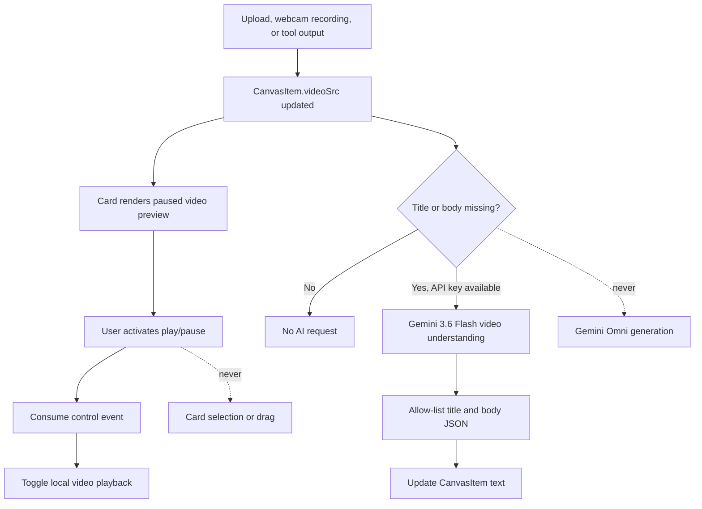

# RFC: Video Content Type for Canvas Cards

- Target: `CanvasItem`, `CardComponent`, `CaptureTool`, canvas ingestion, persistence, and AI helpers

## Summary

Add video as an optional card content type alongside the existing image and text fields. A card may contain a video, an image, or both. In the first release, video is displayed and can be used by Gemini 3.6 Flash to generate missing title and description text. Video generation and editing are never automatic.

This change prepares cards to act as multimodal inputs and outputs. Gemini 3.6 Flash already accepts video input, and the planned Gemini Omni integration will support text-to-video, image-to-video, reference-to-video, and video editing.

## Motivation

The current card model can hold text and image content:

```ts
interface CanvasItem {
  title?: string;
  body?: string;
  imageSrc?: string;
  imagePrompt?: string;
}
```

This is insufficient for workflows where a card represents motion, sound, a generated clip, or an editable video result. Treating video as an image replacement would also prevent future cards from retaining an image reference, storyboard frame, or poster alongside a video.

Video generation has a different cost and latency profile from text generation. The card's existing auto-fill behavior is appropriate for cheap video understanding, but not for video generation. The system therefore needs an explicit boundary between:

- understanding media to fill missing text; and
- generating or editing video as a user-invoked tool action.

## Goals

- Store video content on a card without removing or invalidating image content.
- Supply image and video cards through direct upload from the context tray.
- Capture either a still image or a video from the webcam.
- Render a useful video thumbnail and an obvious play/pause affordance.
- Give playback controls priority over card selection and drag gestures.
- Automatically generate a missing title and/or description from video with Gemini 3.6 Flash.
- Guarantee that mounting, pasting, opening, or auto-filling a card never generates or edits video.
- Make video available as a future input and output for Gemini Omni tools.
- Preserve existing image-only and text-only card behavior and persisted data.

## Non-goals

- Implement Gemini Omni generation or editing in this change.
- Automatically create a video from `imagePrompt`, `imageSrc`, title, or body.
- Require image and video to be mutually exclusive.
- Provide a full timeline editor, trimming, seeking UI, frame extraction, or audio controls on the canvas card.
- Define remote media retention or a production asset-upload service.
- Autoplay video or play more than one card according to a global playback policy.
- Capture microphone audio or provide recording controls beyond start, stop, retry, and confirm.

## Proposed Data Model

Extend `CanvasItem` with optional video fields rather than introducing a discriminated `type` union:

```ts
export interface CanvasItem {
  // Existing fields omitted.
  imageSrc?: string;
  imagePrompt?: string;
  videoSrc?: string;
  videoMimeType?: string;
  videoPosterSrc?: string;
}
```

Field semantics:

- `videoSrc`: a browser-loadable data URL, blob URL, or remote URL for the video.
- `videoMimeType`: the source MIME type, such as `video/mp4`. This is required when it cannot be derived from a data URL or upload response.
- `videoPosterSrc`: an optional browser-loadable image URL used as the video poster. It is derived presentation data, not a replacement for `imageSrc`.

The absence of `videoSrc` means the card has no playable video. `videoPosterSrc` without `videoSrc` is not video content and should not render a play control.

Do not add a single `contentType: "image" | "video"` field. Content capabilities remain additive:

```ts
export function hasImage(item: CanvasItem): boolean {
  return !!(item.imageSrc || item.imagePrompt);
}

export function hasVideo(item: CanvasItem): boolean {
  return !!item.videoSrc;
}
```

This allows all of the following states:

| Image | Video | Meaning                                                    |
| ----- | ----- | ---------------------------------------------------------- |
| No    | No    | Text-only or empty card                                    |
| Yes   | No    | Existing image card                                        |
| No    | Yes   | Video card                                                 |
| Yes   | Yes   | Compound media card; both assets remain available to tools |

### Display Precedence

The compact card has one media viewport. Rendering precedence is a presentation decision, not a data constraint:

1. If `videoSrc` exists, render the video preview.
2. Otherwise, render `imageSrc`.
3. Otherwise, render the existing `generative-image` from `imagePrompt`.
4. Otherwise, render the placeholder.

When both video and image exist, the compact card displays video and the detail view exposes both assets. A later design may add a media switcher without changing the data model.

## Video Rendering

Render video with a native `<video>` element in the existing square media area:

```html
<div class="card-media-area">
  <video src="..." poster="..." preload="metadata" playsinline></video>
  <button type="button" data-card-video-control aria-label="Play video">
    <!-- play icon -->
  </button>
</div>
```

Requirements:

- Use `preload="metadata"`; do not eagerly download every complete video on canvas load.
- Use `playsinline` so playback does not force full-screen mode on mobile browsers.
- Do not use `autoplay`.
- Preserve the video's aspect ratio with `object-fit: cover` in the compact card.
- Use `videoPosterSrc` when available. Without a poster, the browser's decoded initial frame is acceptable after metadata loads.
- Place a play/pause icon button over the video. The icon and accessible label reflect the actual `paused` state.
- Keep playback state local to the rendered component. It is transient and must not be persisted in `CanvasItem`.
- On `ended`, return the control to its play state.
- If `video.play()` rejects, leave the video paused and expose a non-blocking error state; do not mutate card content.

The detail dialog should render the video with native controls and `object-fit: contain`. If the card also has an image, show it as a separate media item rather than silently hiding it.

## Pointer and Keyboard Interaction

The play/pause button takes precedence over card selection, z-order changes, opening, marquee selection, and drag behavior.

The control must:

- handle `click` to call `video.play()` or `video.pause()`;
- stop propagation on `pointerdown` or `mousedown` before the card handler runs;
- stop propagation on `click`; and
- prevent the initiating pointer gesture from entering the card drag path.

`CardComponent` should mark the control with `data-card-video-control`. As defense in depth, the canvas card's `handleMouseDown` must return early when the event target is inside either `[data-card-video-control]` or the existing `[data-card-open]` control.

Clicking elsewhere on the video viewport retains normal card selection and dragging behavior. Clicking the overlaid control only controls playback; it must not select an unselected card or move a selected card.

Keyboard behavior:

- The control is a native `<button>` and is reachable by Tab.
- Enter and Space toggle playback while the button is focused.
- Space on the focused button must not activate canvas panning.
- The label changes between `Play video` and `Pause video`.
- The icon is decorative and hidden from assistive technology.

## Automatic Metadata Generation

Video understanding is part of the existing card auto-fill effect. When a card has `videoSrc`, a Gemini API key, and a missing title or body, the system sends the video to Gemini 3.6 Flash and requests only the missing text fields.

The model request uses the Interactions API with an explicit user input step:

```ts
const content: Interactions.Content[] = [
  { type: "text", text: metadataPrompt },
  { type: "video", mime_type: videoMimeType, data: videoBase64 },
];

await ai.interactions.create({
  model: "gemini-3.6-flash",
  input: [{ type: "user_input", content }],
  response_modalities: ["text"],
  response_format: { type: "text", mime_type: "application/json" },
  generation_config: { thinking_level: "minimal" },
  store: false,
});
```

The exact SDK content shape must be confirmed against the installed `@google/genai` types during implementation. Remote or blob sources are fetched and converted to base64 using the same media-loading boundary currently used for images. The MIME type is taken from the data URL or fetched blob first, then `videoMimeType`; unsupported or unknown types fail without clearing the card.

### Auto-fill Rules

- Trigger only when `title` or `body` is missing.
- A video alone counts as source content for auto-fill.
- Request only text output. Accept only `title` and `body` from parsed JSON.
- Never request a video response modality or use Gemini Omni from the auto-fill effect.
- Do not generate `imagePrompt` merely because a video card has no image.
- Existing image-only behavior may continue to generate `imagePrompt` when appropriate.
- If both image and video exist, include both as context when supported; video remains sufficient by itself.
- Include `videoSrc` and `videoMimeType` in the render and generation signatures so replacing a video can trigger fresh metadata generation.
- Preserve debounce, request de-duplication, `exhaustMap`, error isolation, and progress accounting.

The auto-fill response is an allow-listed update:

```ts
type AutoFillUpdate = Pick<CanvasItem, "title" | "body">;
```

Even if a model returns `videoSrc`, `videoPrompt`, `imageSrc`, or another field, the client discards it. This provides a structural guarantee that auto-fill cannot create media.

### Cost Boundary

Video generation and editing are explicit commands only. Future Gemini Omni tools must be invoked by a visible user action and must not be called from `CardComponent` initialization, reactive item changes, paste handling, or metadata auto-fill.

An explicit video tool invocation should:

1. show the selected operation and its source media;
2. require a user command to start;
3. report long-running progress separately from text generation;
4. write the completed output into `videoSrc` and `videoMimeType`; and
5. preserve existing `imageSrc` unless the user explicitly replaces it.

Stateful Omni editing may additionally persist an interaction ID in namespaced metadata, for example `metadata.geminiOmniInteractionId`. That identifier is tool state and is not required for basic video rendering or Gemini Flash understanding.

## Ingestion and Output

### Context Tray Actions

`CaptureTool` renders two primary buttons directly in the context tray's existing **New** section:

```text
[Upload] [Capture]
```

The context tray does not need a new component boundary. `ContextTrayComponent` already embeds the template returned by `CaptureTool`; the capture tool changes its root template and owns both actions.

The actions have distinct behavior:

- **Upload** opens the browser file picker directly. It never opens the capture dialog.
- **Capture** opens the webcam dialog. The dialog lets the user choose **Image** or **Video** capture mode.

### Direct Upload

Keep a hidden file input in the inline `CaptureTool` template with:

```html
<input type="file" accept="image/*,video/*" multiple hidden />
```

Activating **Upload** clicks this input. After selection, supported files are converted into cards immediately; there is no intermediate modal, pending-preview list, or confirm step.

For each selected file:

- If `file.type` starts with `image/`, create the existing image card with `imageSrc`.
- If `file.type` starts with `video/`, create a video card with `videoSrc` and `videoMimeType`.
- Reject unsupported or empty MIME types with a user-visible error while continuing to import other valid files.
- Preserve file selection order when creating multiple cards.
- Place cards near the canvas viewport center with the existing stagger and z-order behavior.
- Clear the input value after handling the selection so the same file can be selected again.
- Do not open or close the webcam dialog as a side effect.

Uploaded video sets:

- `videoSrc` to a loadable URL;
- `videoMimeType` to `file.type`; and
- no generated title, body, image, or poster before auto-fill runs.

Uploaded image behavior remains unchanged except that it now commits immediately instead of entering the capture dialog's pending list.

### Webcam Capture Dialog

The **Capture** button opens the existing modal dialog. File upload controls are removed from the dialog. Its header contains an Image/Video mode selector implemented as native radio inputs or a segmented control with equivalent keyboard semantics.

The dialog defaults to **Image** each time it opens. Both modes use `navigator.mediaDevices.getUserMedia` with the webcam as input. The initial implementation requests video only:

```ts
navigator.mediaDevices.getUserMedia({
  video: { facingMode: "environment" },
  audio: false,
});
```

The same live `<video autoplay playsinline>` preview is used by both modes. Switching modes stops any active recording and clears unconfirmed captures, but it may retain the active camera stream to avoid a second permission prompt. Closing the dialog always stops every media track and clears transient capture state.

#### Image Mode

Image mode preserves the current webcam snapshot behavior:

1. **Start camera** requests webcam access when no stream exists.
2. **Capture image** draws the current video frame into an off-screen canvas and encodes it as JPEG.
3. Each captured image is appended to the existing pending-image collection without stopping the camera.
4. The dialog shows a thumbnail for every pending image and lets the user remove individual images.
5. The user may continue capturing additional images before confirming.
6. **Confirm** creates one image card per pending image, preserving capture order, and closes the dialog.

Multi-image capture is existing behavior and must be preserved. Confirm is disabled when the pending-image collection is empty. Removing one pending image must not affect the others or stop the camera.

#### Video Mode

Video mode records the webcam stream with the browser's `MediaRecorder` API:

1. **Start camera** requests webcam access when no stream exists.
2. **Start recording** creates a `MediaRecorder` using a MIME type supported by `MediaRecorder.isTypeSupported`.
3. While recording, the primary action becomes **Stop recording** and the mode selector is disabled.
4. `dataavailable` chunks are collected until `stop` completes.
5. The chunks are combined into a `Blob` using the recorder's actual `mimeType`.
6. The dialog shows a playable preview with **Retry** and **Confirm** actions.
7. **Confirm** creates a video card with `videoSrc` and `videoMimeType`, then closes the dialog.

The capture dialog never starts recording merely because Video mode is selected. Recording always requires the explicit **Start recording** action. The first release records the webcam image without microphone audio.

If `MediaRecorder` is unavailable or no supported video MIME type can be selected, disable Video mode and show a concise unsupported-browser message. Image capture should remain available.

### Shared Card Commit

Direct upload and webcam capture use one card-creation boundary rather than duplicating positioning logic. The boundary accepts typed media input:

```ts
type CapturedMedia =
  | { kind: "image"; src: string; mimeType: string }
  | { kind: "video"; src: string; mimeType: string };
```

This union describes an ingestion event, not the persistent `CanvasItem`. It is appropriate for routing one source file into the corresponding card fields and does not make image and video mutually exclusive on a card. The commit function appends cards atomically, assigns stable IDs, staggers multiple uploads, and records `metadata.source` as `"upload"` or `"capture-tool"`.

Pasted or dropped browser `File` objects whose MIME type starts with `video/` may use the same ingestion boundary in a later increment. They are not required to make video available in this RFC because Upload and Capture provide the initial input paths.

Future tool results use the same fields. Inline Gemini Omni output maps base64 video data to a data URL. URI delivery maps the returned active file URI to `videoSrc` after polling succeeds. Tool adapters, not `CardComponent`, own polling and output conversion.

## Persistence and Clipboard

`CanvasItem` is already persisted as structured data, so optional fields are backward compatible and require no migration for existing cards. `migrateItem` should pass video fields through unchanged.

Large videos should not be embedded indefinitely as base64 inside the main canvas item store. The first implementation may use data or blob URLs for parity with images, but production persistence should store the video `Blob` in an asset cache and keep a stable asset reference on the card. Blob URLs must be recreated after reload and revoked when no longer needed.

Canvas clipboard serialization should preserve the optional video fields for internal card copy/paste. Copying a card does not duplicate remote media bytes. External clipboard ingestion should accept video files but must not interpret arbitrary plain-text URLs as video without an explicit import action.

## Component Changes

### `canvas.component.ts`

- Add the optional video fields and `hasVideo` helper.
- Include video controls in the early-return guard in `handleMouseDown`.
- Render video and image media in the detail dialog.
- Add explicit download behavior only if a stable source is available.

### `capture.tool.ts`

- Render **Upload** and **Capture** as inline context-tray actions.
- Move the hidden file input outside the dialog and accept both image and video files.
- Commit valid uploads immediately without opening a modal.
- Remove Upload from the capture dialog.
- Add Image/Video webcam capture mode state.
- Keep canvas snapshot capture for Image mode and add `MediaRecorder` for Video mode.
- Preserve the existing multi-image pending collection, individual removal, and batch confirmation in Image mode.
- Preview, retry, and confirm one pending recording in Video mode.
- Stop recording and release media tracks on mode change, dialog close, and component teardown.
- Route uploaded and captured media through shared card positioning and commit logic.

### `card.component.ts`

- Include video fields in `isSameRenderableItem` and the generation signature.
- Add local playback state and event handling.
- Apply display precedence in the compact media viewport.
- Restrict video-triggered auto-fill to missing title/body fields.
- Pass video content to the AI helper without adding any video-generation path.

### `ai-helpers.ts`

- Extend `CardContent` with video source and MIME fields.
- Generalize URL-to-base64 loading into a media helper that returns the actual MIME type.
- Add video content to the Gemini 3.6 Flash request.
- Validate and allow-list structured text updates.

### `canvas.component.css`

- Generalize the image area styles to a media area.
- Size video identically to image previews.
- Position the play/pause button above the thumbnail with a stable hit target.
- Preserve the selected outline and existing card dimensions.

## State and Event Flow



## Error Handling

- File picker cancellation: make no state change and leave the dialog closed.
- Mixed valid and invalid upload: import valid files and report skipped files once.
- Webcam permission denial: keep the dialog open with retry and close actions.
- Recording failure: discard incomplete chunks, retain the live camera when possible, and allow retry.
- Dialog close during recording: stop the recorder, discard the unconfirmed recording, and stop every media track.
- Media decode failure: show an unavailable-video placeholder and retain the source for retry or inspection.
- Fetch or base64 conversion failure: log the auto-fill error, decrement progress, and leave existing text unchanged.
- Gemini failure or invalid JSON: do not partially update the card; allow retry after source or API-key change.
- Playback rejection: restore the play state and do not start drag or selection.
- Unsupported MIME type: reject ingestion with a user-visible error rather than storing a broken card.
- Stale async response: apply generated metadata only if the current video generation signature still matches the request signature.

The final stale-response check is important because replacing a video while Gemini is analyzing the previous source must not apply the old video's title or description to the new one.

## Privacy and Safety

- Use `store: false` for automatic video understanding.
- Do not send a video until auto-fill eligibility is established and an API key is available.
- Avoid logging base64 media, signed URLs, or complete model payloads.
- Keep Gemini Omni safety and regional restrictions in the tool layer. Automatic metadata generation must surface model safety failures without retry loops.
- Remote video loading must respect the application's existing URL and content-security policy; this RFC does not introduce a proxy.

## Rollout Plan

1. Add the data model, rendering, playback control, and internal persistence support behind no new generation behavior.
2. Update `CaptureTool` with inline Upload/Capture actions, immediate image/video upload, and webcam Image/Video modes.
3. Extend Gemini 3.6 Flash auto-fill for title and description, with allow-listed output and stale-response protection.
4. Add focused tests for ingestion, recording lifecycle, pointer precedence, playback state, auto-fill eligibility, and mixed image/video cards.
5. Introduce explicit Gemini Omni tools separately after their input/output adapters, progress model, and cost confirmation UX are designed.

## Acceptance Criteria

- The context tray renders **Upload** and **Capture** directly without first opening a dialog.
- **Upload** accepts one or more image and video files and creates cards immediately without a modal or confirmation step.
- **Capture** opens the webcam dialog and does not open the file picker.
- The webcam dialog provides keyboard-accessible Image and Video modes and defaults to Image on each open.
- Image mode supports repeated snapshots, individual removal, and batch confirmation into one card per pending image.
- Video mode starts recording only after explicit user action and creates a video card only after recording stops and the user confirms.
- Closing the dialog or switching modes cannot leave an active recorder or orphaned camera track.
- A mixed upload creates image and video cards in file order while preserving valid files if another file is rejected.
- A card with only `videoSrc` displays a paused video preview and play button.
- Activating play/pause neither selects nor drags the card and does not change its z-index.
- Keyboard activation toggles playback without starting canvas pan mode.
- A video card with a missing title or body requests text metadata from Gemini 3.6 Flash exactly once per unchanged generation signature.
- The automatic request asks for text JSON only and cannot update media fields.
- No automatic path calls Gemini Omni or requests video output.
- A card can retain `imageSrc` and `videoSrc` simultaneously.
- When both are present, video is shown in the compact card and both are available in the detail view and tool input model.
- Existing image-only, generated-image, text-only, selection, drag, open, copy/paste, and persistence behavior remains unchanged.
- Replacing a video invalidates prior auto-fill de-duplication, while a stale response from the old video is ignored.
- Video playback or decode errors leave the card movable and editable.

## Testing Strategy

Unit tests:

- `hasVideo` and mixed-content capability checks.
- Auto-fill eligibility for video-only, complete-text, and mixed-media cards.
- AI response allow-listing and malformed JSON.
- Generation signatures changing with source or MIME type.
- Stale metadata response rejection.

Component tests:

- Inline Upload invokes the hidden file input without opening the dialog.
- Inline Capture opens the webcam dialog without invoking the file input.
- Mixed image/video upload commits correctly typed cards immediately and in order.
- Repeated Image-mode snapshots append previews, individual removal preserves the remaining images, and Confirm commits all pending images in capture order.
- Capture mode switching clears unconfirmed media and stops an active recording.
- Dialog close stops all webcam tracks in Image, Video, and recording states.
- Video recording uses the recorder's actual MIME type and requires confirmation before commit.
- Video rendering precedence over image in the compact card.
- Image remains represented in the detail view when video also exists.
- Play/pause events do not invoke `onMouseDown` or `onOpen`.
- Enter and Space update playback state and accessible labels.
- `ended` and rejected `play()` restore the play state.

Integration tests:

- Upload a video file, persist and reload the canvas, then play it.
- Record and confirm a webcam video, then verify its card can play and auto-fill text.
- Generate missing title and body from a fixture video while verifying no media update is accepted.
- Copy and paste a mixed image/video card.
- Replace a video during metadata analysis and verify stale text is not applied.

## Open Questions

- What maximum video byte size and duration should browser ingestion accept?
- Should webcam video capture enforce a maximum recording duration before automatically stopping?
- Should a later release request microphone audio as an explicit opt-in for webcam video?
- Should auto-analysis require an explicit user preference because video is sent to an external model, even though inference is cheap?
- Should only one compact card play at a time, or may cards play concurrently?
- Which persistent asset store will replace long-lived data and blob URLs?
- When both image and video exist, should Gemini Flash always receive both, or should tool context choose the relevant media?
- Should `videoPosterSrc` be generated locally from a decoded frame, supplied by tool output, or both?

These questions do not block the additive data model or the rule that automatic behavior is limited to text metadata generation.
