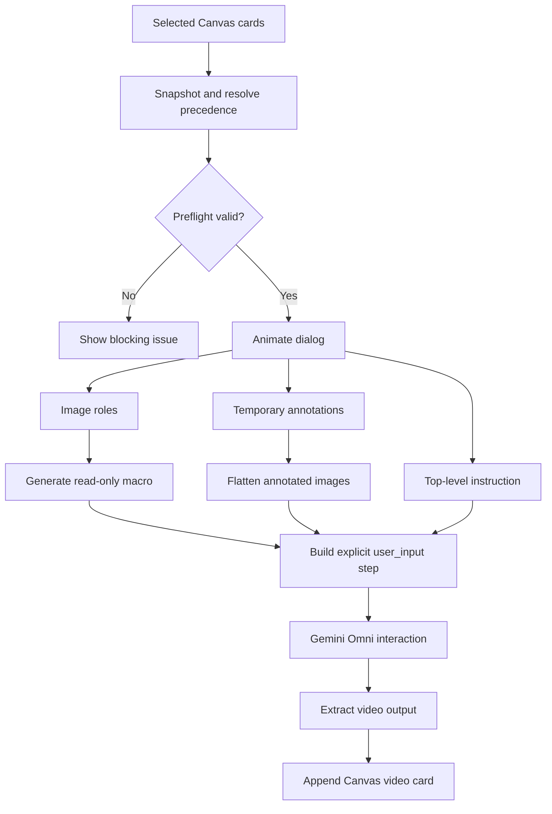

# RFC: Animate Tool for Mixed-Media Video Generation

- Status: Proposed
- Scope: Canvas context tray and Gemini Omni Flash integration
- Model: `gemini-omni-flash-preview`

## Summary

Add an **Animate** tool to the Canvas context tray. Animate uses every selected
card that can be represented by Gemini Omni Flash, opens a review dialog for
image annotations and media roles, and generates one video card from the
resulting mixed-media prompt.

Each selected card contributes exactly one input according to this precedence:

1. `videoSrc`
2. `imageSrc`
3. text assembled from `title`, `body`, and `imagePrompt`

An image card may be marked as a starting frame, reference, or automatic input.
The dialog assigns stable labels such as `Image1` and shows a generated,
read-only prompt prefix using Gemini Omni's documented macros:

```text
[# Sources <FIRST_FRAME>@Image1] [# References <IMAGE_REF_0>@Image2]
```

Users can draw temporary annotations over any selected image. The annotation is
flattened with the source image only for the generation request; it does not
modify the selected card or persist after the dialog closes.

## Motivation

The Canvas already supports image, video, and text cards, but video generation
is not available as an operation over an arbitrary selection. Animate turns a
selection into a single ordered multimodal instruction while keeping the user
in control of image semantics. In particular, explicit first-frame and
reference roles avoid relying on prompt inference for the cases where visual
continuity matters.

## Goals

- Add Animate to the context tray whenever at least one selected card resolves
  to a supported video, image, or text input.
- Use every selected card exactly once after applying the per-card media
  precedence rule.
- Let users annotate each selected image without changing the source card.
- Let users assign image roles and refer to stable image IDs in their prompt.
- Keep generated role macros visible and non-editable.
- Let users choose the model-default, `16:9`, or `9:16` output aspect ratio.
- Submit a mixed-media Interactions API request to Gemini Omni Flash.
- Add the generated video to the Canvas as a new card without replacing the
  selected inputs.
- Integrate with the existing RxJS task queue and Gemini API-key handling.

## Non-goals

- A timeline, clip trimming, transitions, keyframes, or multi-shot editor.
- Persisting annotation layers or role choices on Canvas cards.
- Iterative edits through `previous_interaction_id` in the first release.
- Video extension or interpolation.
- Supporting more than one video input in a request. Gemini Omni currently does
  not support reasoning across multiple videos.
- Adding controls for duration, resolution, audio, or model selection in the
  first release. These can be expressed in the prompt where supported.
- External media storage, URI delivery, or stateful editing.

## Existing Integration Points

`ContextTrayComponent` derives `selected$` from the shared `items$` state and
instantiates each tool under `src/components/context-tray/tools`. Animate will
follow the same component boundary as Sketch:

- `src/components/context-tray/context-tray.component.ts` instantiates and
  renders `AnimateTool`.
- `src/components/context-tray/tools/animate.tool.ts` owns dialog state,
  actions, effects, and the reactive template.
- `src/components/context-tray/tools/animate.tool.css` owns dialog and canvas
  layout under a root `.animate-tool` selector.
- `src/components/context-tray/llm/animate.ts` owns request preparation,
  Interactions API invocation, and video-output extraction.
- `src/components/context-tray/tasks.ts` runs the generation observable and
  preserves the existing stop-all-tasks behavior.

The implementation must use the installed `@google/genai` SDK types rather
than locally guessed response interfaces.

## Proposed Design

### 1. Resolve selected cards

When the dialog opens, snapshot the current selected cards in their `items$`
order. Selection changes while the modal is open do not alter the request.
Resolve each card with the following pure operation:

```ts
type AnimateInput =
  | { kind: "video"; cardId: string; src: string; mimeType?: string }
  | { kind: "image"; cardId: string; src: string; imageId: string }
  | { kind: "text"; cardId: string; text: string };
```

Resolution rules:

- If `videoSrc` is non-empty, use the video and ignore that card's image and
  text fields.
- Otherwise, if `imageSrc` is non-empty, use the image and ignore that card's
  text fields.
- Otherwise, join non-empty `title` and `body` values into one
  labeled text part.
- If none of those fields contains usable content, omit the card and report it
  in the dialog before submission.

`imagePrompt` does not count as an image because it is text. It only participates
in the text fallback when the card has neither `videoSrc` nor `imageSrc`.

Image IDs are assigned from the resolved image order, starting at `Image1`.
They remain stable for the lifetime of the dialog and are displayed beside
each image with a Copy button. Copy writes the literal ID, such as `Image2`, to
the clipboard so it can be pasted into the instruction.

### 2. Validate model limitations

The dialog performs preflight validation before enabling Generate:

- A Gemini API key is required.
- At least one selected card must resolve to a usable input.
- At most one resolved input may be a video. If more than one selected card
  resolves to video, submission is blocked and the dialog explains that Gemini
  Omni does not support multiple video inputs. No video is silently discarded.
- Video MIME type must normalize to a Gemini-supported video type.
- Referenced media must be loadable before submission.
- At most one image may have the `starting-frame` role.

The tool still uses all resolved cards for supported combinations, including
one video with images and text. If the service rejects a particular mixed-media
combination, the task surfaces the API error and does not create a partial
output card.

### 3. Dialog experience

The Animate button opens a modal containing a vertical list of the resolved
inputs, followed by the instruction editor, output controls, and actions.

For an image input, show:

- The stable image ID and Copy button.
- A segmented role control: **Auto**, **Starting frame**, **Reference**.
- A canvas containing the source image and temporary drawing overlay.
- A Clear annotations action that restores the unmodified source image.

For video input, show a native video preview and its source card title when
available. For text input, show the exact text that will be sent. Video and text
inputs do not have role controls or annotation canvases.

Each image canvas uses pointer events and coordinate scaling so mouse, pen, and
touch input follow the same path. Canvas dimensions match the source image's
intrinsic dimensions; CSS constrains only its displayed size. The first release
uses the shared sketch stroke color and line width, with no drawing-style
controls.

The dialog actions are:

- **Clear** on each image: remove only that image's annotations.
- **Cancel**: close the dialog and discard all temporary state.
- **Generate**: validate, flatten annotations, submit one task, and close the
  dialog.

Closing by Escape has the same behavior as Cancel. While request preparation is
in progress, Generate is disabled to prevent duplicate submissions.

The output controls include an aspect-ratio segmented control with **Default**,
**16:9**, and **9:16** options. Default is selected whenever the dialog opens.
It omits `aspect_ratio` from the request and lets Gemini choose its default;
the other options send their literal ratio. The choice is local dialog state
and is not persisted between generations.

### 4. Image roles and generated macro

Each image starts with role `auto`.

```ts
type AnimateImageRole = "auto" | "starting-frame" | "reference";
```

The macro is derived state and is never parsed back from user text. It is
recomputed whenever a role changes:

- The starting-frame image contributes
  `[# Sources <FIRST_FRAME>@ImageN]`.
- Reference images contribute one references group in image order:
  `[# References <IMAGE_REF_0>@ImageN <IMAGE_REF_1>@ImageM]`.
- Auto images contribute no macro.
- Reference indexes are contiguous and are recalculated after every role
  change.

Only one image can be the starting frame. Selecting that role for another image
returns the previous starting frame to `auto`.

Because a native textarea cannot make only a prefix read-only, the UI renders a
read-only macro region immediately before the editable instruction textarea
inside one labeled instruction field. The two regions are visually contiguous,
and the submitted instruction is computed as:

```ts
[macro, instruction.trim()].filter(Boolean).join(" ");
```

This keeps the macro visible and non-editable without intercepting text-editing
keys or maintaining cursor offsets. The user may type image IDs in the editable
instruction, but changing typed text never changes image roles.

### 5. Flatten annotations

Maintain one temporary canvas state per resolved image. On submission:

1. Decode the original image.
2. Draw it into an export canvas at intrinsic resolution.
3. Draw the transparent annotation layer over it.
4. Export the result as a PNG data URL.
5. Strip the data-URL header and send `image/png` plus base64 data.

If an image has no annotation strokes, preserve its original MIME type and
bytes instead of re-encoding it. All image and video inputs are converted to
inline base64 before submission, including media whose Canvas source is a blob
or remote URL. Flattening must not write to `items$`, mutate `imageSrc`, or
retain canvases after the dialog closes.

Images fetched from remote URLs must be converted to same-origin-readable data
before drawing. A CORS-tainted canvas is a blocking preparation error with the
affected image ID in the message.

### 6. Build the Gemini Omni request

Convert resolved inputs to `Interactions.Content[]` in snapshot order. Each
card contributes one content part:

- Video: `{ type: "video", mime_type, data }`
- Image: `{ type: "image", mime_type, data }`
- Text: `{ type: "text", text }`

Append the combined macro and top-level instruction as the final text content
so it acts as the request-level direction after the supporting media and card
text. The Interactions request uses an explicit `Interactions.Step[]` input:

```ts
const input: Interactions.Step[] = [
  {
    type: "user_input",
    content: [...cardContent, { type: "text", text: instruction }],
  },
];

await ai.interactions.create({
  model: "gemini-omni-flash-preview",
  input,
  response_format: {
    type: "video",
    ...(aspectRatio === "default" ? {} : { aspect_ratio: aspectRatio }),
  },
  generation_config: {
    video_config: { task: hasVideo ? "edit" : hasImage ? "image_to_video" : "text_to_video" },
  },
  store: false,
});
```

The exact SDK property casing must follow the installed SDK version. The
implementation should first compile against its exported request types rather
than use `any` to force the documented wire shape.

Use inline base64 for every image and video input and for the generated video
output. Do not use Gemini Files, URI delivery, external blob storage, or an
object-URL persistence layer. Extract the first inline video from the
model-output steps; treat missing video data as an error.

`store: false` is intentional: the first release does not retain an Interaction
resource and therefore cannot use `previous_interaction_id`. Stateful edits can
be considered separately and are not designed by this RFC.

### 7. Add the generated video card

On a successful response, create one `CanvasItem` with:

- A unique `animate-result-` ID.
- `videoSrc` as a `data:video/mp4;base64,...` URL.
- `videoMimeType` from the model output, defaulting to `video/mp4` only when the
  response omits it.
- Title `Animated video`.
- Body set to the user's editable top-level instruction, excluding the
  generated macro.
- Position from `getNextPositions` relative to the snapshotted input cards.
- Standard video-card dimensions and the next z-index.

Add the card only after the complete video is available. Do not insert an empty
placeholder containing a potentially large partial response. Generation errors
flow through the existing task runner and leave `items$` unchanged.

## State and Data Flow



Dialog state is local to `AnimateTool` and recreated from the selection snapshot
on every open. Shared application state changes only once, when the completed
video card is appended to `items$`.

## Error Handling

Errors that can be detected before submission appear in the dialog and disable
Generate. Runtime failures are surfaced through the existing task error path;
the implementation should add user-visible task failure reporting if the task
system still only logs errors when Animate is implemented.

Error messages should identify the affected input where possible:

- `Image2 could not be loaded.`
- `Image1 cannot be exported because its source does not allow canvas access.`
- `Card “Walkthrough” has an unsupported video type.`
- `Animate supports one video input at a time.`
- `Gemini returned no video.`

API keys, base64 media, and generated responses must not be logged.

## Accessibility and Interaction

- The dialog has an accessible name and returns focus to the Animate button on
  close.
- Every canvas has an accessible label containing its image ID. The source image
  remains visible as an `img` alternative or equivalent labeled preview for
  users who cannot operate the drawing surface.
- Role controls use native radio inputs or an equivalent keyboard-operable
  segmented control.
- Copy actions announce success without changing layout.
- All validation text is associated with the relevant control and the summary
  uses an `aria-live` region.
- Pointer capture prevents a stroke from ending unexpectedly when the pointer
  leaves the canvas.

## Testing Strategy

### Pure unit tests

- Card precedence selects video over image over text.
- Text assembly omits empty fields and preserves card order.
- Empty cards are reported and omitted.
- Image IDs are stable and follow resolved image order.
- Macro generation handles no roles, one starting frame, multiple references,
  role changes, and contiguous reference reindexing.
- Selecting a second starting frame resets the first to auto.
- Task selection resolves to `edit`, `image_to_video`, or `text_to_video`.
- More than one resolved video fails preflight.
- Model-output parsing extracts base64 data and MIME type and rejects an empty
  video response.

### Component tests

- Animate is enabled only for a usable selection and a configured Gemini key.
- Opening snapshots the selection; later selection changes do not alter rows.
- Every image can be annotated and cleared independently.
- The macro is visible, cannot be edited, and updates from role controls.
- Copy writes the expected `ImageN` value.
- Aspect ratio starts at Default and can be changed to `16:9` or `9:16`.
- Cancel and Escape discard dialog state.
- Generate cannot submit twice.

### Integration tests

Mock `@google/genai`; tests must not call the live API.

- Verify one explicit `user_input` step with one part per resolved card and the
  final combined instruction.
- Verify annotated images are flattened and unannotated images retain their
  original payload.
- Verify per-card precedence prevents lower-priority media from entering the
  request.
- Verify Default omits `aspect_ratio`, while `16:9` and `9:16` are forwarded in
  `response_format`.
- Verify every image and video input and the generated output use inline base64
  without Files API or URI-delivery calls.
- Verify successful output appends exactly one playable video card.
- Verify preparation and API failures leave `items$` unchanged.

## Delivery Plan

### Phase 1: Pure request model

- Add input resolution, image-role, macro, validation, task-selection, and
  output-extraction functions with unit tests.
- Compile a minimal Omni request against the installed SDK to confirm request
  property names and output step types.

### Phase 2: Dialog and annotations

- Add `AnimateTool` and its minimal component CSS.
- Implement stable image IDs, role controls, copy actions, pointer-based
  annotation layers, and the split read-only/editable instruction field.
- Add focused component tests.

### Phase 3: Generation and Canvas output

- Add the Gemini Omni request module and task integration.
- Convert mixed media, flatten annotations, extract the generated video, and
  append the result card.
- Add mocked integration coverage and manually verify mouse, touch, keyboard,
  and video playback behavior.

## Acceptance Criteria

- Selecting text-only cards can generate a video from all selected text.
- Selecting image cards shows every image in the dialog with a stable copyable
  ID, independent annotations, and an Auto/Starting frame/Reference role.
- Selecting a card containing video, image, and text sends only its video.
- Selecting a card containing image and text sends only its image.
- Selecting roles produces the documented visible macro and users cannot edit
  that macro directly.
- The output control offers Default, `16:9`, and `9:16`; Default omits the
  request field and explicit choices set it.
- Auto-role images produce no macro entry but remain in the media input.
- Annotated image payloads visibly contain both the source and overlay while
  source Canvas cards remain unchanged.
- Every usable selected card contributes exactly one request part, followed by
  the top-level instruction part.
- A selection resolving to multiple videos is blocked with a clear explanation.
- All media sent to or returned by Gemini uses inline base64, with no external
  storage or URI delivery.
- A successful request adds one playable video card near the selected cards.
- Cancellation or any failure adds no output card and does not mutate inputs.

## Decisions

1. The dialog includes an output aspect-ratio control with Default, `16:9`, and
   `9:16`. Default omits the request field rather than translating it to a fixed
   ratio.
2. All input and output media uses inline base64. The feature introduces no
   external storage, Gemini Files API dependency, or URI-delivery path.
3. Stateful editing is outside this RFC. Requests use `store: false`, and the
   first release does not retain or expose interaction IDs.
4. Per-card media precedence remains strict. Text fields from a card are not
   sent when that card resolves to video or image.
